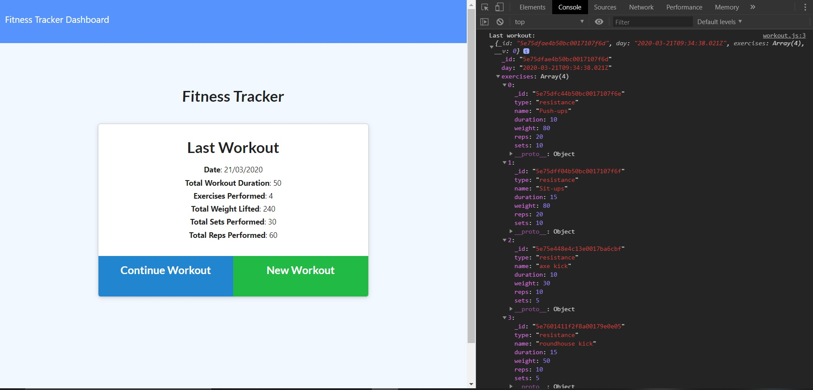
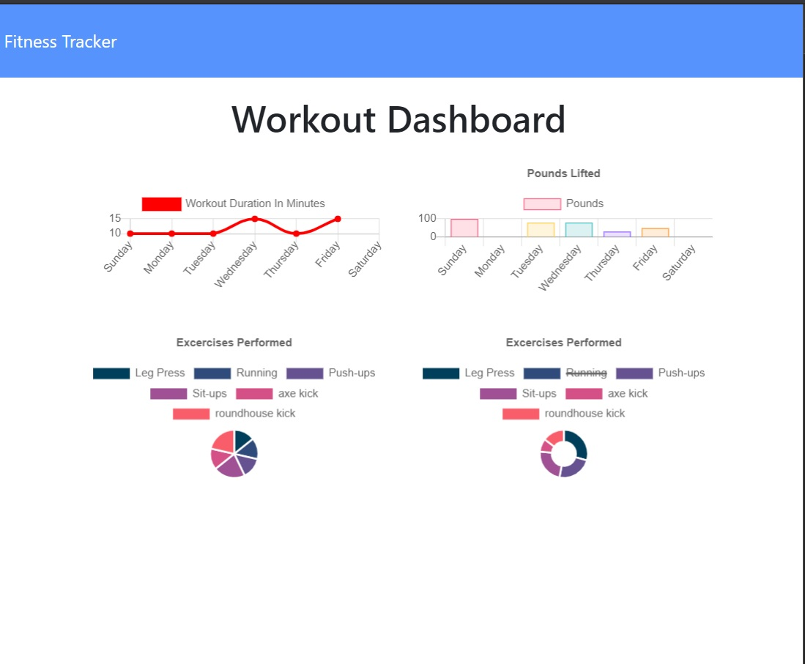

# workoutTracker

Summary

The web application is a workout tracker that enables the user to create a session consisting of
exercises. The user can input the:
- type of exercise
- name of exercise
- duration
- distance
- reps
- sets
The user can either select to add additinal exercises, or complete the current workout session. The
data is sent to a database and then returned the the homepage displaying the accumulated data of all
entered exercises. The following npm's and methods where used in the development of this application:
- express
- path
- Procfile
- .gitignore
- get
- post
- put
- delete
- .env
- dotenv

Getting Started

This documentation will assist you in viewing this project. To view the project either open
the url of the deployed application with the following address in any browser:

https://guarded-castle-80939.herokuapp.com/

Download and clone the repository from GitHub using the following command:

git clone https://github.com/pozengineer/workoutTracker.git

This application was built using:
- HTML: HyperText Markup Language that allows the developer to describe pages
- CSS: Style Sheet Language that allows the developer to style an HTML document
- BootStrap: Library of HTML and CSS files and code https://getbootstrap.com/
- API: Application Programming Interface, which is a software intermediary that
  allows two applications to talk to each other.
- Node.js: An open-source, cross-platform, JavaScript runtime environment that
  executes JavaScript code outside of a browser.
- Express.js: An open source web application framework for Node.js
- Heroku: Is a platform as a service (PaaS) that enables developers to build, run,
  and operate applications in the cloud
- mongoDB: Is a cross-platform document-oriented database program. It uses JSON-like
  documentswith schema.

